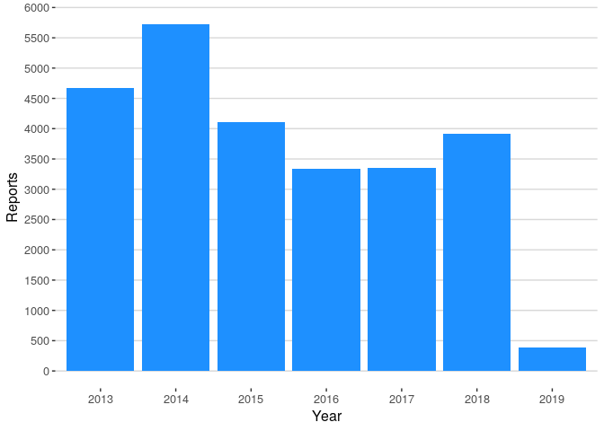
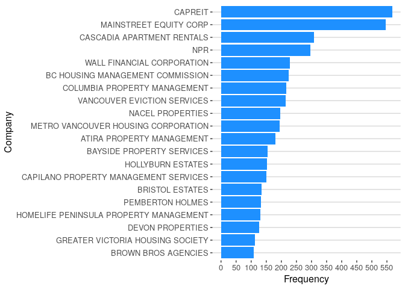
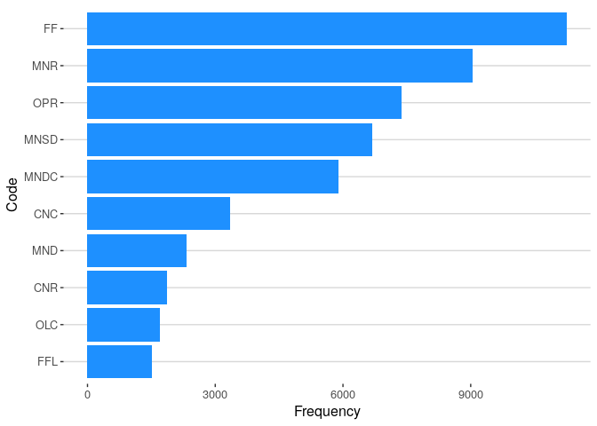

# Analyzing the RTB disputes

In BC and many provinces of Canada, a system exists for resolving
disputes between tenants and landlords. Under authority of the
Residential Tenancy Branch (RTB), tenants or landlords can enter what is
effectively arbitration to resolve disputes. A few months ago we
discovered that all the RTB disputes and their resolutions are put up
online in public. We then went ahead and downloaded all the ones we
could. This is what we have found so far.

### Important Caveat

Many issues between tenants and landlords never make it to the RTB
process. Many people don’t know it exists or how to use it. The process
can be cumbersome to use and there are filing deadlines people may not
know about. What we are seeing is only narrow slice of people in BC
effected by these problems.

Also many landlords do business under different names. I don’t have
access to this information so it is possible that some of the worst
offenders aren’t shown for that simple reason.

### Summary of the data

Total number of reports: 124146

Total number of reports which list a company: 25481

Percent of reports which list a company: 20.53%

The RTB system was introduced in 2007, but it’s not until 2013 that
people seem to start using it.

In particular, property company names are not listed until 2013

So what are the companies that keep coming up in disputes?

Total number of unique companies: 8481

Dispute Codes
-------------

Each case comes with a set of dispute codes to help categorize the
report. A natural question is ask is what codes occur the most often?

These codes can mean multiple things so side-by-side with their
descriptions, we see that most disputes are recovering costs from
repairs and pets.

| Code |  Frequency| Description                                                                            | Category                                    |
|:-----|----------:|:---------------------------------------------------------------------------------------|:--------------------------------------------|
| FF   |      11251| Recover filing fee from the other party                                                | Application Process                         |
| MNR  |       9037| For unpaid rent or utilities                                                           | Money or Monetary Orders                    |
| MNR  |       9037| Monetary order for unpaid rent or utilities                                            | Landlord filed for dispute resolution       |
| MNR  |       9037| Recover cost of emergency repairs                                                      | Repairs or the Condition of the Rental Unit |
| MNR  |       9037| Recover cost of emergency repairs                                                      | Money or Monetary Orders                    |
| OPR  |       7382| Tenant has not paid the rent or utilities                                              | End of Tenancy Notices                      |
| OPR  |       7382| Tenant has not paid rent or utilities                                                  | Landlord filed for dispute resolution       |
| MNSD |       6680| Keep all or part of pet damage deposit or security deposit                             | Security or Pet Deposit                     |
| MNSD |       6680| To keep all or part of pet damage deposit or security deposit                          | Money or Monetary Orders                    |
| MNSD |       6680| Return of all part of pet damage deposit or security deposit                           | Money or Monetary Orders                    |
| MNSD |       6680| Return pet damage deposit or security deposit                                          | Security or Pet Deposit                     |
| MNDC |       5890| Owed or compensation for damage or loss under the Act, regulation or tenancy agreement | Money or Monetary Orders                    |
| MNDC |       5890| Owed or compensation for damage or loss under the Act, regulation or tenancy agreement | Money or Monetary Orders                    |
| MNDC |       5890| Compensation for damage or loss under the Act, regulation or tenancy agreement         | Repairs or the Condition of the Rental Unit |
| CNC  |       3342| Cause                                                                                  | End of Tenancy Notices                      |
| MND  |       2323| Recover cost of damage to the unit, site or property                                   | Repairs or the Condition of the Rental Unit |
| MND  |       2323| For damage to the unit, site or property                                               | Money or Monetary Orders                    |
| CNR  |       1860| Unpaid rent                                                                            | End of Tenancy Notices                      |
| CNR  |       1860| Cancel a notice to end tenancy relating to unpaid rent                                 | Tenant filed for dispute resolution         |
| OLC  |       1702| Order to require a party to comply with the Act, regulation or tenancy agreement       | Miscellaneous                               |

Further work that’s needed
--------------------------

### Keyword analysis

This dataset includes free text that we have largely ignored. We can
really still drill down and ask. How many of these disputes involve
repairs as the main issue?

### Tracking which party wins disputes

While easy for a human being, it’s hard for tools to automatically
determine in whose favor was the judgement. It would be nice to find a
while to automatically determine this and surface it.
